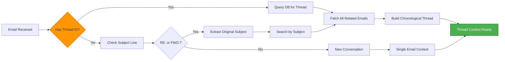
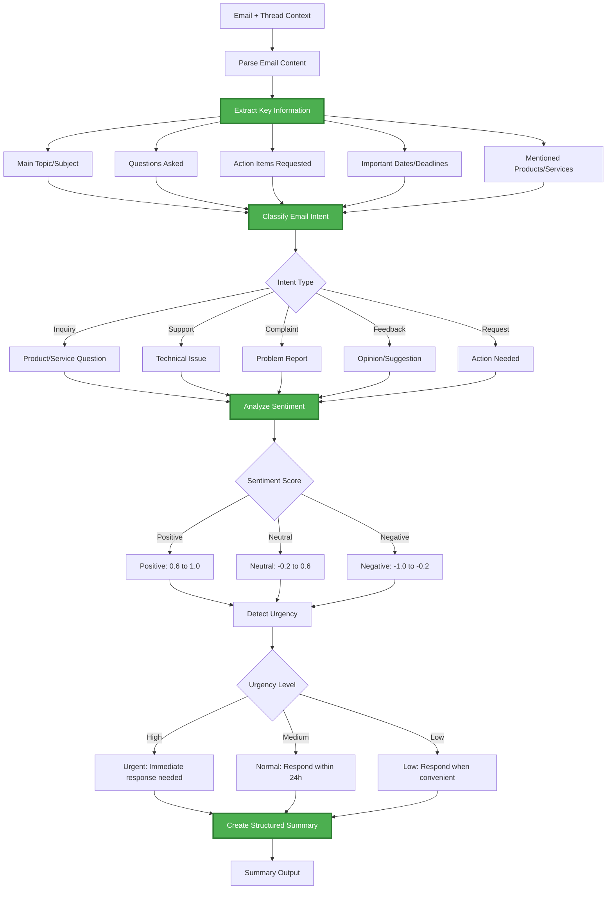
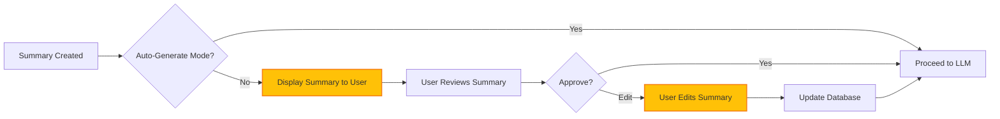
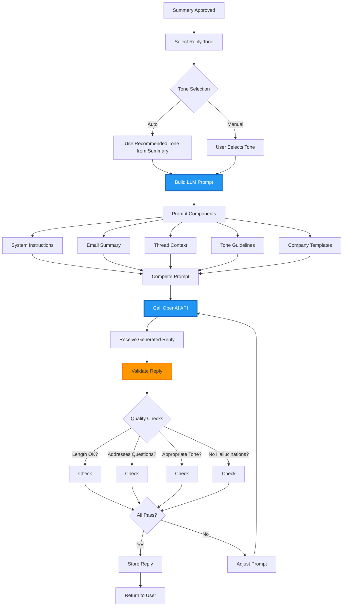
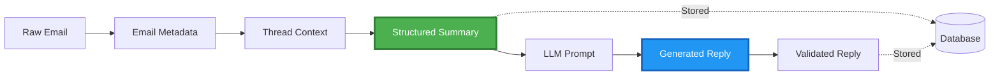

# AI Email Reply Generator - Workflow Documentation

## Overview

This document provides a detailed view of the email processing workflow, including the trail logic and email summarization steps before LLM reply generation.

## Complete Email Processing Pipeline

```mermaid
flowchart TD
    Start([Incoming Email]) --> Receive[Receive Email via API]
    Receive --> Store1[Store Original Email in DB]
    Store1 --> Extract[Extract Email Metadata]

    Extract --> Trail{Check Email Trail}
    Trail -->|Has Thread| FetchThread[Fetch Email Thread History]
    Trail -->|Single Email| SingleEmail[Process as Standalone]

    FetchThread --> BuildContext[Build Conversation Context]
    SingleEmail --> BuildContext

    BuildContext --> Summarize[Email Summarization Step]

    Summarize --> ExtractKey[Extract Key Information]
    ExtractKey --> ClassifyIntent[Classify Email Intent]
    ClassifyIntent --> AnalyzeSentiment[Analyze Sentiment]
    AnalyzeSentiment --> DetectUrgency[Detect Urgency Level]

    DetectUrgency --> CreateSummary[Create Structured Summary]
    CreateSummary --> StoreSummary[Store Summary in DB]

    StoreSummary --> ReviewPoint{Review Summary?}
    ReviewPoint -->|Manual Review| DisplaySummary[Display Summary to User]
    ReviewPoint -->|Auto-Generate| ProceedToLLM[Proceed to LLM]

    DisplaySummary --> UserApproval{User Approves?}
    UserApproval -->|Yes| ProceedToLLM
    UserApproval -->|Edit| EditSummary[User Edits Summary]
    EditSummary --> UpdateSummary[Update Summary in DB]
    UpdateSummary --> ProceedToLLM

    ProceedToLLM --> SelectTone[Select Reply Tone]
    SelectTone --> BuildPrompt[Build LLM Prompt with Summary]
    BuildPrompt --> CallLLM[Call OpenAI API]

    CallLLM --> ValidateReply[Validate Generated Reply]
    ValidateReply --> QualityCheck{Quality Check}

    QualityCheck -->|Pass| StoreReply[Store Reply in DB]
    QualityCheck -->|Fail| Regenerate[Regenerate with Adjusted Prompt]
    Regenerate --> CallLLM

    StoreReply --> ReturnReply[Return Reply to User]
    ReturnReply --> End([End])

    style Summarize fill:#4CAF50,stroke:#2E7D32,stroke-width:3px,color:#fff
    style CreateSummary fill:#4CAF50,stroke:#2E7D32,stroke-width:3px,color:#fff
    style StoreSummary fill:#4CAF50,stroke:#2E7D32,stroke-width:3px,color:#fff
    style Trail fill:#FF9800,stroke:#F57C00,stroke-width:2px,color:#fff
    style CallLLM fill:#2196F3,stroke:#1565C0,stroke-width:3px,color:#fff
```



## Detailed Step-by-Step Process

### Phase 1: Email Reception & Storage

**Step 1: Receive Email**

- API endpoint receives email data (subject, body, sender, metadata)
- Validate email format and required fields
- Assign unique email ID

**Step 2: Store Original Email**

- Save complete email to database
- Preserve original formatting and attachments metadata
- Record timestamp and source

**Step 3: Extract Metadata**

- Parse email headers
- Extract sender information
- Identify email type (new, reply, forward)
- Extract thread/conversation ID if present

---

### Phase 2: Email Trail Analysis



**Step 4: Check Email Trail**

- Determine if email is part of an existing conversation
- Look for thread ID in headers
- Check for "RE:" or "FWD:" in subject line
- Search database for related emails

**Step 5: Build Conversation Context**

- If thread exists: Fetch all previous emails in conversation
- Order emails chronologically
- Identify conversation participants
- Track conversation flow (who said what, when)

---

### Phase 3: Email Summarization (Critical Step)



**Step 6: Extract Key Information**

- **Main Topic**: What is the email primarily about?
- **Questions**: List all questions asked by sender
- **Action Items**: What does the sender want us to do?
- **Dates/Deadlines**: Any time-sensitive information
- **Entities**: Products, services, people, or companies mentioned
- **Previous Context**: Summary of thread history (if exists)

**Step 7: Classify Email Intent**

- **Inquiry**: Customer asking about products/services
- **Support**: Technical help or troubleshooting
- **Complaint**: Problem or dissatisfaction
- **Feedback**: Opinion, review, or suggestion
- **Request**: Specific action needed (refund, change, etc.)
- **Follow-up**: Response to previous conversation

**Step 8: Analyze Sentiment**

- Use sentiment analysis to determine emotional tone
- Score: -1.0 (very negative) to +1.0 (very positive)
- Identify emotional keywords
- Consider context from email trail

**Step 9: Detect Urgency Level**

- **High**: Keywords like "urgent", "ASAP", "immediately", angry tone
- **Medium**: Standard business communication
- **Low**: General inquiries, feedback, casual tone

**Step 10: Create Structured Summary**

The summary includes:

```json
{
  "email_id": "unique-email-id",
  "timestamp": "2025-12-25T08:14:46+05:30",
  "sender": {
    "email": "customer@example.com",
    "name": "John Doe",
    "previous_interactions": 3
  },
  "thread_info": {
    "is_thread": true,
    "thread_id": "thread-123",
    "email_count": 4,
    "thread_summary": "Customer inquiring about product pricing, previously asked about features"
  },
  "content_analysis": {
    "main_topic": "Request for enterprise pricing and volume discount",
    "questions": [
      "What is the pricing for 100+ users?",
      "Do you offer volume discounts?",
      "What payment terms are available?"
    ],
    "action_items": [
      "Provide enterprise pricing quote",
      "Explain volume discount structure",
      "Share payment options"
    ],
    "mentioned_entities": ["enterprise plan", "100 users", "volume discount"],
    "dates_deadlines": ["Need quote by end of week"]
  },
  "classification": {
    "intent": "inquiry",
    "sub_intent": "pricing_request",
    "confidence": 0.95
  },
  "sentiment": {
    "score": 0.7,
    "label": "positive",
    "tone": "professional and interested"
  },
  "urgency": {
    "level": "medium",
    "reason": "Deadline mentioned but not immediate",
    "suggested_response_time": "within 24 hours"
  },
  "context_summary": "Returning customer who previously inquired about features. Now ready to discuss pricing for team deployment. Shows strong buying intent.",
  "recommended_tone": "professional, helpful, sales-oriented"
}
```

**Step 11: Store Summary in Database**

- Save structured summary for audit trail
- Link to original email
- Enable analytics and reporting

---

### Phase 4: Review Point (Optional)



**Step 12: Review Summary (Optional)**

- Display summary to user via API response
- Allow manual review and editing
- User can adjust intent, tone, or add context
- Useful for training and quality control

---

### Phase 5: LLM Reply Generation



**Step 13: Select Reply Tone**

- **Professional**: Formal business communication
- **Friendly**: Warm but professional
- **Empathetic**: For complaints or sensitive issues
- **Concise**: Brief and to-the-point
- **Detailed**: Comprehensive explanations

**Step 14: Build LLM Prompt**

The prompt includes:

```python
prompt = f"""
You are a professional email assistant helping to reply to customer emails.

CONTEXT:
- Email Intent: {summary['classification']['intent']}
- Sentiment: {summary['sentiment']['label']} ({summary['sentiment']['score']})
- Urgency: {summary['urgency']['level']}
- Thread Summary: {summary['thread_info']['thread_summary']}

CUSTOMER EMAIL SUMMARY:
Main Topic: {summary['content_analysis']['main_topic']}

Questions Asked:
{format_questions(summary['content_analysis']['questions'])}

Action Items Requested:
{format_action_items(summary['content_analysis']['action_items'])}

Context: {summary['context_summary']}

INSTRUCTIONS:
- Write a {tone} email reply
- Address all questions asked
- Provide clear next steps for action items
- Match the urgency level: {summary['urgency']['level']}
- Keep the tone {summary['recommended_tone']}
- Be specific and helpful
- Do not make up information you don't have

REPLY:
"""
```

**Step 15: Call OpenAI API**

- Send prompt to GPT-4 or GPT-3.5-turbo
- Set appropriate parameters (temperature, max_tokens)
- Handle rate limiting and errors

**Step 16: Validate Generated Reply**

- Check reply length (not too short or too long)
- Verify all questions are addressed
- Ensure tone matches requirements
- Check for hallucinations or incorrect information
- Validate professional language

**Step 17: Quality Check**

- If validation fails, adjust prompt and regenerate
- Maximum 3 retry attempts
- Log quality metrics

**Step 18: Store Reply**

- Save generated reply to database
- Link to original email and summary
- Record generation metadata (model, tokens, time)

**Step 19: Return Reply to User**

- Send reply via API response
- Include confidence score
- Provide option to regenerate or edit

---

## Data Flow Summary



## Key Benefits of This Workflow

### 1. **Transparency**

- Every step is logged and traceable
- Summary provides clear audit trail
- Easy to debug and improve

### 2. **Quality Control**

- Structured summary ensures LLM has good context
- Validation prevents poor quality replies
- Manual review option for critical emails

### 3. **Context Awareness**

- Thread analysis provides conversation history
- Sentiment and urgency guide response style
- Entity extraction captures important details

### 4. **Flexibility**

- Can run fully automated or with human review
- Tone and style are configurable
- Easy to add custom business logic

### 5. **Continuous Improvement**

- Feedback loop for learning
- Analytics on email types and responses
- Template optimization over time

## API Endpoints for Each Phase

### Email Submission

```http
POST /api/v1/email/submit
Content-Type: application/json

{
  "subject": "Product inquiry",
  "body": "Email content...",
  "sender": "customer@example.com",
  "thread_id": "optional-thread-id"
}
```

### Get Email Summary

```http
GET /api/v1/email/{email_id}/summary

Response:
{
  "summary": { /* structured summary object */ },
  "created_at": "timestamp"
}
```

### Generate Reply (Auto)

```http
POST /api/v1/email/{email_id}/generate-reply
Content-Type: application/json

{
  "tone": "professional",
  "auto_send": false
}
```

### Generate Reply (With Custom Summary)

```http
POST /api/v1/email/{email_id}/generate-reply
Content-Type: application/json

{
  "summary_override": {
    "main_topic": "Custom topic",
    "action_items": ["Custom action"]
  },
  "tone": "friendly"
}
```

## Configuration Options

```yaml
email_processor:
  # Enable/disable automatic reply generation
  auto_generate: false

  # Require manual review of summaries
  require_summary_review: true

  # Sentiment analysis threshold
  sentiment_threshold: 0.5

  # Urgency detection keywords
  urgency_keywords:
    high: ["urgent", "asap", "immediately", "emergency"]
    medium: ["soon", "this week", "by friday"]

  # LLM settings
  llm:
    model: "gpt-4"
    temperature: 0.7
    max_tokens: 500

  # Quality validation
  validation:
    min_length: 50
    max_length: 1000
    check_questions_addressed: true
    max_retries: 3
```

## Next Steps

This workflow will be implemented in the following files:

- `backend/ai/email_processor.py` - Trail analysis and summarization
- `backend/ai/reply_generator.py` - LLM integration with LangGraph
- `backend/api/v1/endpoints/email.py` - API endpoints
- `backend/db/models.py` - Database models for storing summaries

The implementation will use **LangGraph** to orchestrate this multi-step workflow, ensuring proper state management and error handling at each phase.
